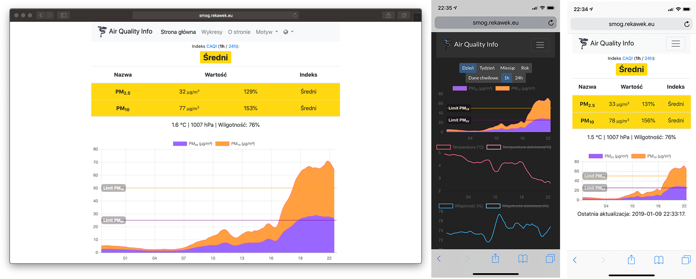

# Air Quality Info

Air Quality Info to panel informacyjny oparty o PHP, wyświetlający dane nt. czystości powietrza pochodzące z amatorskiego detektora smogu [Nettigo Air Monitor](https://easyeda.com/nettigo/Nettigo-Air-Monitor) / [Luftdaten](https://luftdaten.info/en/construction-manual/).



[Demo](http://smog.rekawek.eu/)

## Cechy

* Ładny i przejrzysty interfejs
* Dane zapisane w bazie RRD
* Wykresy renderowane za pomocją ChartJS
* Zewnętrzna baza danych nie jest wymagana
* Wsparcie dla wielu czujników w ramach jednej strony
* Panel dostępny w języku polskim i angielskim

## Wymagania

* PHP 7
* Zainstalowane rozszerzenie php-rrd

## Instalacja automatyczna

Plik [install.sh](install.sh) to interaktywny skrypt który zainstaluje panel i niezbędne oprogramowanie (nginx, PHP) na serwerze linuksowym opartym o Debiana lub Ubuntu.

Dystrybucje wspierane przez skrypt to:

* Debian 9 Stretch
* Raspbian 9 Stretch
* Ubuntu 18.04 Bionic

Aby uruchomić automatyczną instalację, należy wpisać dwie komendy:

```
curl https://raw.githubusercontent.com/trekawek/air-quality-info/master/install.sh > /tmp/install.sh
bash -e /tmp/install.sh
```

Rozsądnym pomysłem jest przeanalizowanie skryptu przed jego uruchomieniem komendą `bash`. Po uruchomieniu skrypt pyta niezbędne parametry:

```
Enter the site domain (or press Enter to just use IP ...):
```
Należy wpisać nazwę domeny pod którą panel ma być dostępny (domena musi być oczywiście wykupiona i podpięta pod serwer). Jeśli nie mamy domeny, wciskamy Enter - panel będzie dostępny pod adresem IP.

```
Enter username: ...
```
Nazwa użytkownika, potrzebna do konfiguracji czujnika.

```
Enter password:
```
Hasło, j/w. Hasło będzie niewidoczne przy wpisywaniu.

```
Enter sensor id: ...
```
ID czujnika.

Na końcu instalator wyświetla podsumowanie:
```
Page is available at http://...

Configuration:
Server: ...
Path: /main/update
Port: 80
User: trekawek
Password: [redacted]
```

Informacje z sekcji "Configuration" należy przepisać do ustawień czujnika. Voila!

## Instalacja manualna

### Konfiguracja serwera WWW

Serwer WWW powinien przekierować wszystkie żądania do nieznanych ścieżek do strony [htdocs/index.php](src/htdocs/index.php). Apache2 będzie skonfigurowany automatycznie dzięki dołączonemu plikowi [.htaccess](src/htdocs/.htaccess) (wymaga mod_rewrite). Dla nginxa, dostępna jest [przykładowa konfiguracja](docs/sample-nginx.conf).

### Kroki instalacji

1. Sklonuj lub ściągnij to repozytorium.
2. Skopiuj plik [htdocs/config-empty.php](src/htdocs/config-empty.php) do `config.php`. Wpisz nazwę użytkownika, hasło i ID sensora.
3. Skopiuj katalog [htdocs](src/htdocs) do serwera web.
4. Upewnij się, że serwer ma prawo zapisu w katalogu [htdocs/data](src/htdocs/data).
5. Skonfiguruj detektor, aby wysyłał dane *własnego API*. Nazwa użytkownika i hasło powinny być takie jak w pliku `config.php`. Ścieżka to: `/main/update`, gdzie `main` odnosi się do nazwy urządzenia w pliku `config.php`.
